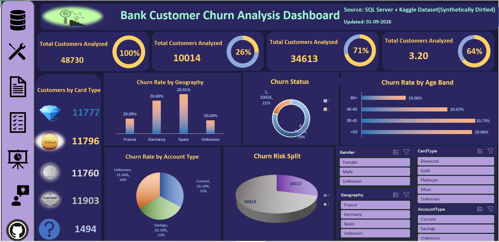

# Bank Customer Churn Analysis

Bank customer churn analysis with an interactive dashboard to identify high-risk customer segments, key churn drivers, and service gaps using SQL Server and Excel.

## Objective
The objective of this project is to analyze bank customer churn data, identify the customer segments most likely to leave, and understand whether satisfaction, geography, or account type explain who churns.

## Dataset
Bank Customer Churn Dataset — Kaggle-based, synthetically dirtied for cleaning practice, used for data cleaning, analysis, and dashboard development.
The dataset contains 48,730 customer records with information such as credit score, geography, gender, age, balance, number of products, card type, satisfaction score, and churn status (Exited).

## Tools Used
* SQL Server Management Studio (SSMS)
* Microsoft Excel
* Pivot Tables
* Power Query
* Charts
* Excel Dashboard

## Files in this repo
* `01_Bank_Customer_Churn_Analysis_Unclean_Dataset.csv` — raw bank customer churn dataset
* `02_Bank_Customer_Churn_Analysis_Dashboard.xlsx` — interactive Excel dashboard
* `03_Bank_Customer_Churn_Key_Finding_Business_Analysis.docx` — detailed key findings and business analysis
* `04_Bank_Customer_Churn_Analysis_Business_Report.docx` — final project report
* `05_Dashboard_Screenshot.png` — dashboard preview image

## Methodology
* Reviewed and cleaned the raw customer dataset using SQL Server Management Studio (SSMS).
* Identified and removed duplicate records using ROW_NUMBER().
* Flagged outliers in Age and Balance instead of deleting them.
* Parsed Last Transaction Date into a clean date field, and marked unrecoverable dates with a separate Last Transaction Missing Flag instead of filling them.
* Standardized Geography, Gender, Card Type, and Account Type into clean categories, grouping unrecognized entries as "Unknown."
* Built a clean analysis table with derived fields such as Age Band, Balance Band, and High Churn Risk Flag.
* Used Pivot Tables and charts in Excel to summarize churn data, validated against equivalent SQL queries.
* Developed an interactive Excel dashboard to make the results easier to understand.

## Key Findings
* Churn rate stays around 19–21% across every geography, age band, and account type — none of these alone explains who leaves.
* Out of 48,730 customers, 10,014 have churned — a 21% churn rate, well above a healthy 5–10% benchmark.
* 14,117 customers (29% of the base) are flagged high-risk for churn.
* Average customer satisfaction score is only 3.20 out of 5 (64%).
* Card type is evenly distributed across Diamond, Gold, Platinum, and Silver (roughly 11,700–11,900 each) — tier size alone isn't a churn driver.
* Customers with missing ("Unknown") geography or account type churn at the same rate as customers with complete records.

## Recommendations
* We recommend investigating behavioural and service signals — satisfaction score, complaints, and activity status — as the likely real drivers of churn.
* We suggest prioritizing the 14,117 flagged high-risk customers by value (balance, products held) rather than treating the group uniformly.
* A review of overall service quality is recommended, since a 3.20/5 average satisfaction score leaves clear room for improvement.
* We recommend fixing data capture for Geography, Account Type, and Card Type at the source, so "Unknown" segments shrink over time.
* Retention strategy should be revisited portfolio-wide, since the 21% churn rate is systemic rather than isolated to one segment.

## Dashboard
The interactive dashboard provides a clear view of:
* Total customers analyzed and total churned customers
* Churn rate by geography
* Churn rate by age band
* Churn rate by account type
* Churn risk split (low vs high)
* Customers by card type

## Conclusion
This project provides a structured view of bank customer churn data and helps identify which customer segments and behaviours carry the highest churn risk. The analysis can support better retention targeting, closer monitoring of high-risk customers, and a more informed look at service quality.
The dashboard and supporting analysis can be used as a simple decision-support tool for reviewing customer churn information.
